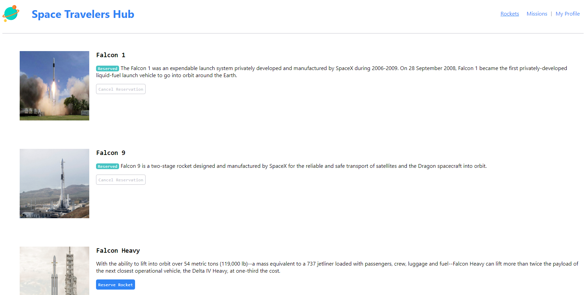
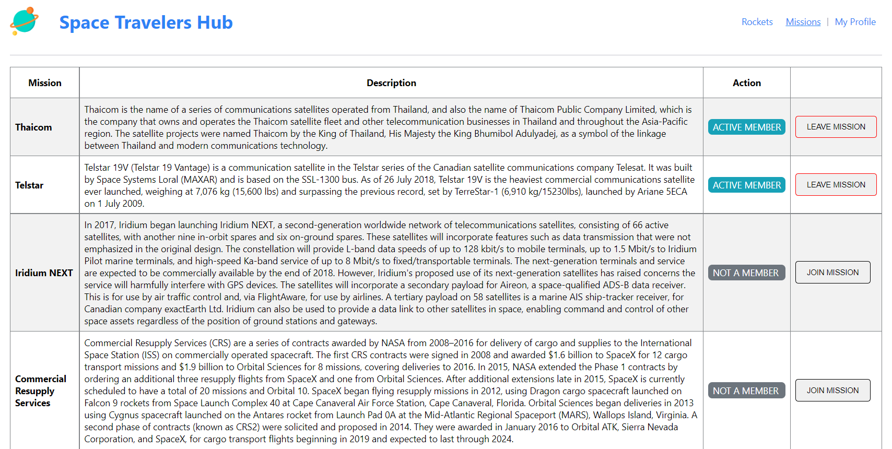

## Preview

<p align="center">Rocket Page</p>


<p align="center">Mission Page</p>



# Space Travelers Hub

Space Travelers Hub is web application for a company that provides commercial and scientific space travel services. Consists of Rockets, Missions, and the My Profile section. 

> In this application users can book rockets and join selected space missions available to go in the space.

## Features

- Reserve a Rocket by clicking `Reserve Rocket` button.
- Cancel Reservation of a Rocket.
- Join a Mission by clicking `Join mission` button in the Missions' tab.
- Leave a Joined mission.
- See reserved rockets and joined mission check `My Profile` tab.

Live Demo [Space Travelers Hub](https://space-traveler-hubs.herokuapp.com/)
=======

## Built With

- React
- Redux
- CSS3

## Clone the project

You can download or clone this project by running this command from your terminal:

git clone https://github.com/Ghilain/space-travelers-hub.git
This will create a directory in the name of the project folder.

Once you have the project files and folders, open it with your text editor.

Next, switch inside the project directory and run:

```
npm install
```
This will install all the necessary dependencies in the local `node_modules` folder.
=======

Finally, start your development server by running:

```
npm start
```

### `npm test`

Launches the test runner in the interactive watch mode.

## Author

👤 **Haji Bamsi**

- GitHub: [@bamsi](https://github.com/bamsi)
- Twitter: [@hibamsi](https://twitter.com/hibamsi)
- LinkedIn: [Haji Bamsi](https://www.linkedin.com/in/bamsi/)

👤 **Ghilain Ishimwe**

- GitHub: [@Ghilain](https://github.com/Ghilain/)
- Twitter: [@GhilainIshimwe](https://twitter.com/GhilainIshimwe)
- LinkedIn: [Ghilain Ishimwe](https://www.linkedin.com/in/ghilain-ishimwe/)

## 🤝 Contributing

Contributions, issues, and feature requests are welcome!

## Show your support

Give a ⭐️ if you like this project!

## Acknowledgments

- Hat tip to code reviewers and to everyone who reviewed the project and made suggestions.

## 📝 License

This project is [MIT](./MIT.md) licensed.